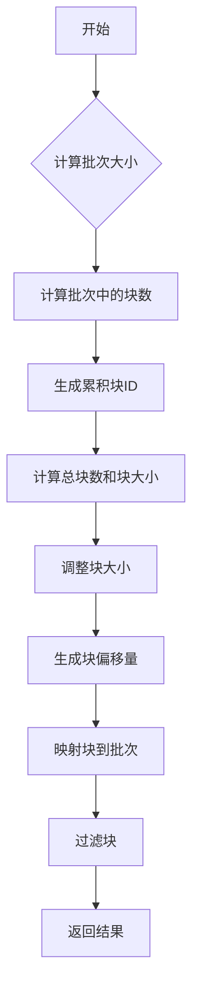

readme

```mermaid
flowchart TD
    A[开始] --> B{计算批次大小}
    B --> C[计算批次中的块数]
    C --> D[生成累积块ID]
    D --> E[计算总块数和块大小]
    E --> F[调整块大小]
    F --> G[生成块偏移量]
    G --> H[映射块到批次]
    H --> I[过滤块]
    I --> J[返回结果]
```
